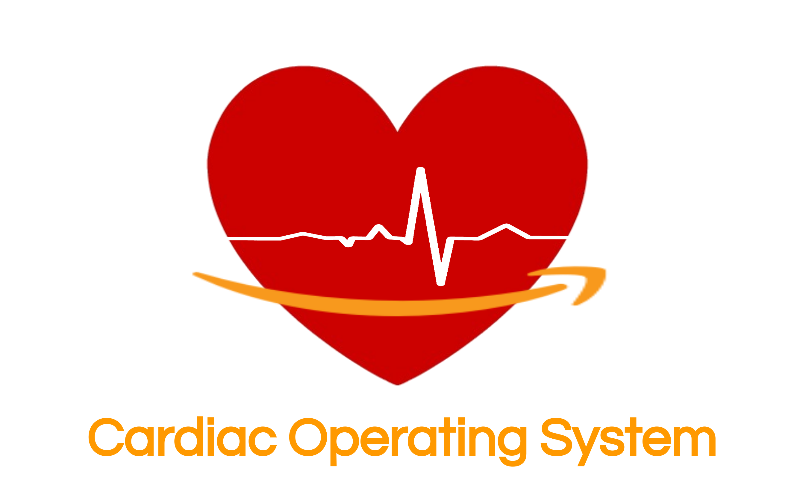
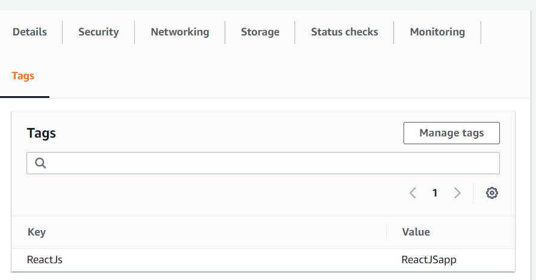
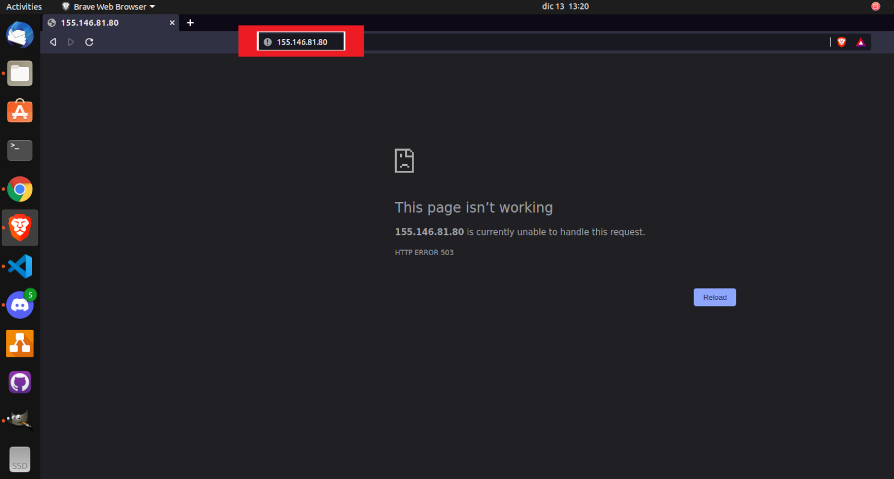
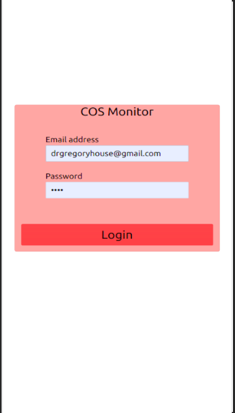

# Cardiac Operating System

  

# Table of contents:
 
- [Cardiac Operating System](#cardiac-operating-system)
- [Table of contents:](#table-of-contents)
- [Introduction:](#introduction)
- [Connection Diagram:](#connection-diagram)
  - [Server:](#server)
  - [App Diagram:](#app-diagram)
- [AWS Setup:](#aws-setup)
  - [Wavelength Zones:](#wavelength-zones)
  - [VPC:](#vpc)
  - [Gateway Carrier:](#gateway-carrier)
  - [EC2:](#ec2)
  - [Elastic IP:](#elastic-ip)
  - [Connection:](#connection)
- [Code CI/CD:](#code-cicd)
  - [CodePipeline:](#codepipeline)
  - [Code Source:](#code-source)
  - [CodeDeploy:](#codedeploy)
  - [Review:](#review)
  - [Check Deployment:](#check-deployment)
- [App UI:](#app-ui)
  - [**Login Screen**:](#login-screen)
  - [**Monitor Tab**:](#monitor-tab)
  - [**Summary**:](#summary)
  - [**Report**:](#report)
  - [**Additional notes**:](#additional-notes)
  - [**Past Reports**:](#past-reports)
  - [**ECG Details**:](#ecg-details)
  - [**Historical Tab**:](#historical-tab)
  - [**Simulator Tab**:](#simulator-tab)
      - [Functionality:](#functionality)

DISCLAIMER: This application is used for demonstrative and illustrative purposes only and does not constitute an offering that has gone through regulatory review. It is not intended to serve as a medical application. There is no representation as to the accuracy of the output of this application and it is presented without warranty.

## Introduction, Inspiration and Problem

The Current COVID-19 pandemic changed everything. From the way we do business, congregate, transport and most specially the way we go to the doctor and take care of our health. This made Telemedicine one if not the way to move forward regarding simple patient care. So, we decided to research what kind of solutions we are adopting. 

Sometimes telemedicine software is offered as a standalone platform, but these days it's not unusual to find it also provided within existing medical practice management (PM) software. 
Even standalone telemedicine platforms will often easily integrate with other medical software, such as for Electronic Health Records (EHR) or  to make it easier to work with patient histories, making it easier to diagnose or treat medical conditions.
 (1).

But that's the main problem. The sophistication of a system does not matter if few people are using it (at sometimes prohibitive costs) and it has no reach to zones where it was intended to operate. Also, most systems are way too cumbersome to use, have very old UI's and are not adaptable to modern needs.
Even though we have several, very sophisticated systems **they have not reached mass market**, are too hard to use and do not provide useful data.

And that's the second problem, the current meeting apps do not meet the healthcare needs regarding just taking Biometrics or following up patients and self care.

#### But what if we can change that?

## Why 5G?

5G has grabbed the attention of people everywhere (both good and bad), but most people only have heard of its promises at giving more speed, better coverage and reduce congestion. But 5G is much more than just fast downloads; its unique combination of high-speed connectivity, very low latency, and ubiquitous coverage will support smart vehicles and transport infrastructure such as connected cars, trucks, and buses, where a split-second delay could mean the difference between a smooth flow of traffic and a 4-way crash at an intersection. This of course, is vital for Telemedicine applications.

5G will enable us to control more devices remotely in applications where real-time network performance is critical, such as remote surgery. To be fair for the IoT promise to become a reality it needs of 5G and mesh networks which is the only other viable option for the billions of devices that will be connected to the internet in the coming years.
 

So, in essence we have two main problems for this application nowadays, Scalability and congestion of 4G networks and both are solved with 5G networks.

# COS

COS (Cardiac Operating System) is a Smart telemedicine platform, based on IoT devices that provide Vital signs and historical values. This to transform the way telemedicine is provided and solve the biggest problem in relation to distance check-ups, which is taking biometrics. Our current version consists of an Oxygen Saturation Thimble, an ECG sensor and a contactless Thermometer that can send real time information to a Teams application. This allowing distance consultations and follow ups to become more seamless and to grab a real biometrics and vital signs while doing them.

# Connection Diagram:

## Server:

## App Diagram:

# AWS Setup:

To make the wavelength network work we followed the following AWS documentation, however we will show some important points that must be followed to correctly configure everything.

https://docs.aws.amazon.com/wavelength/latest/developerguide/get-started-wavelength.html

## Wavelength Zones:

We must have access to the appropriate wavelength zone, so check that it is activated as we can see in the image.

The test will be carried out with the NOVA platform, on a cell phone connected to the zone: us-west-2-wl1-sfo-wlz-1

## VPC: 

The VPC settings must be as follows so that you can connect to the Wavelength network successfully.

It is very important for the IPv4 CIDR to be:
10.0.0.0/24

## Gateway Carrier:

In this step, the important thing will be to select the correct AWS Wavelength region in the subnet.

## EC2:

The configuration of the EC2 is very important that the following parameters are maintained:

Instance type:

- t3.medium, t3.xlarge, and r5.2xlarge for applications that need cost effective general purpose compute; 

- g4dn.2xlarge for applications that need GPUs such as game streaming and ML inference at the edge.

Tags:

Although it is possible to configure this later, place the following tags at the end of the creation of the instance, these will serve to carry out the deployment of the app later.

Whatever configuration you want to do outside of the instance type there are no restrictions.

To make the correct deployment of the application it is important that the IAM role of our instance has the following permissions enabled.

## Elastic IP:

One of the parts that can give more problems if it is not done correctly will be to assign the Elastic IP to our instance.

We just have to click on assign as the box shows.

## Connection:

If everything we did was done correctly, we should be able to access our instance from the option that I show below.

Thanks to the fact that we will use a code deployment pipeline, it is all the access we need.

# Code CI/CD:

## CodePipeline:

In AWS CodePipeline create a pipeline with the following characteristics.

## Code Source:

Select Github or your preferred code repository as a base.

## CodeDeploy:

When configuring the deployment, it is very important to respect the tags that we use in the EC2 configuration so that the platform detects it correctly.

If everything worked correctly we should see the following.

## Review:

Inside the code folder, check in detail the scripts that the machine will run to do all the deployment, the deployment will run on EC2 as an Apache server.

[WebPage/scripts](https://github.com/altaga/COS/tree/main/WebPage/scripts)

In turn, the details of the deployment are defined in the file.

[WebPage/appspec.yml](https://github.com/altaga/COS/blob/main/WebPage/appspec.yml)

Since everything worked correctly we should see that the pipeline is like this.

## Check Deployment:

CarrierIP:
[155.146.81.80](http://155.146.81.80)

Now we can check that our application is correctly deployed when entering a device with 5G thanks to the NOVA platform.

Here we can see how the page is not accessible if we are not connected to a Verizon 5G zone, in this case the pc is connected to a normal local internet.

# App UI:

## **Login Screen**:

The login screen gives access to the platform by entering the following credentials.

Login Credentials:

    Email:drgregoryhouse@gmail.com
    Password:toor

## **Monitor Tab**:

The platform communicates with IoT devices through MQTT, which allows us to receive the data and graph it with the lowest possible latency.

ECG: 

The data received from the holter monitor is processed in real time on the page through a filter to be able to see the EKG graph correctly.

Oxygen Saturation:

The data received by the oxygen saturation sensor are:

- BPM.
- blood's SatO2.
- Plethysmography Curve

Tab Explorer:

This section helps us to navigate between the 5 tabs that the monitor consists of.

Patient Data:

In this section we can see the patient's data, in addition to having a convenient button to switch between the English system and the international system for temperature.

**Monitor Tab**:

## **Summary**:

In the summary we can see a summary of the general data of the patient and manipulate them as the doctor sees fit, all these data will be permanently modified once the submit button is clicked.

## **Report**: 

In this section the doctor will be able to fill in the data obtained during the consultation, the vital signs data are filled in automatically while the data is received. 

## **Additional notes**:

All the data that cannot be added through the report can be filled in this section, to be able to add tables, images or any type of additional data that is required.

## **Past Reports**:

In order to review the previous reports of any patient, once you select the patient, the dates of the previous reports will automatically appear so that you can display them.

## **ECG Details**:

In the case of the ECG details, we will have to be receiving ECG data (you can activate the simulator data), once we receive at least 10 - 15 seconds of data, the ECG symbol will turn from gray to red, this means that Once the pressures are done, we will send the data to an ECG analysis API to obtain relevant data for a doctor or physician/cardiologist.

## **Historical Tab**:

This tab has the function of displaying the stored data of the patients in their consultations, which is downloaded from a database that is updated as the patient has consultations.

To display the data we have to select the patient and then move on the calendar to review the data of the day that we need to display.

## **Simulator Tab**:

As this project is based on IoT 

This tab has the function of simulating the data in real time of a patient during a consultation, in order to use it, we will select a patient from the drop-down list and activate the sensors that we want to simulate, once the sensors that we want to simulate are in color, we will return to the monitor tab to be able to see the real-time data of the patient.

To Test this application enter here first!:

[155.146.81.80](http://155.146.81.80)

With these login credentials:

    Email:drgregoryhouse@gmail.com
    Password:toor

#### Functionality:

You can follow the next video to use the application:

Video: Click on the image

Or the following Instructions:

To test the simulator, we must log in to the page first:

Then, we will select one of the patients, in this case Victor Altamirano. We can see that no data appears yet.

Next, we go to the simulator tab. Select the patient we want to simulate and click on the buttons on the right, this will simulate one of the sensors.

We will activate the 2 sensors to show how they arrive at the platform at the same time.

To see this go back to the monitor tab.

